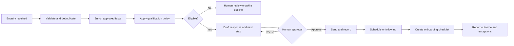

# Product hypotheses

## Product policy

Autobiz begins with one product. Other ideas remain hypotheses until the first
product has repeatable demand, delivery, and economics.

## Product 1 — Lead-to-Onboarding Operations

**Status:** Candidate for validation
**Target customer:** Small consultancy or specialist agency
**Buyer hypothesis:** Owner, commercial lead, or operations manager

### Customer problem

New enquiries arrive through multiple channels. Qualification, follow-up,
scheduling, proposals, document collection, and onboarding rely on memory and
manual coordination. Leads are lost and customers experience unnecessary delay.

### Promised outcome hypothesis

Every eligible enquiry is acknowledged, progressed, and visible; qualified clients
enter onboarding through a consistent, supervised process.

### Service boundary

Included in a pilot:

- one intake channel;
- one qualification policy;
- lead enrichment from approved sources;
- drafted acknowledgement and follow-up;
- human approval before external sending;
- scheduling handoff;
- onboarding checklist;
- exception queue and weekly report.

Excluded initially:

- autonomous pricing or contractual commitments;
- payments, refunds, or changes to bank details;
- mass prospecting;
- legal, tax, medical, credit, or employment decisions;
- arbitrary customer-specific software development; and
- unsupervised deletion or modification of source-system records.

### Workflow

### Pilot pricing hypotheses

The financial workbook contains editable scenarios. Test a modest setup fee and
monthly subscription, but discuss value before quoting. Never treat the planning
assumptions as market evidence.

### Success metrics

- median first-response time;
- percentage of eligible leads followed up within target;
- qualified-lead-to-meeting conversion;
- onboarding cycle time;
- exception and rework rate;
- founder/operator minutes per lead;
- customer-reported value; and
- contribution margin.

## Product decision scorecard

Score each candidate 1–5 after interviews.

| Criterion | Weight | Lead-to-onboarding | Evidence status |
|---|---:|---:|---|
| Problem frequency | 15% | TBD | Interviews needed |
| Economic impact | 20% | TBD | Baseline needed |
| Urgency | 15% | TBD | Buying behavior needed |
| Workflow repeatability | 15% | TBD | Observation needed |
| Access to customers | 10% | TBD | Outreach test needed |
| Data and compliance fit | 10% | TBD | Segment assessment needed |
| Automation leverage | 10% | TBD | Manual pilot needed |
| Competitive differentiation | 5% | TBD | Alternatives research needed |

## Product backlog — not committed

- recurring management-report preparation;
- document intake and completeness checking;
- customer-support triage;
- proposal preparation; and
- renewal and account-health monitoring.
