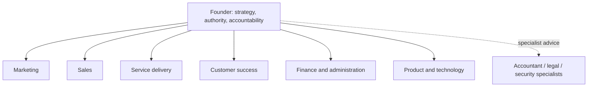
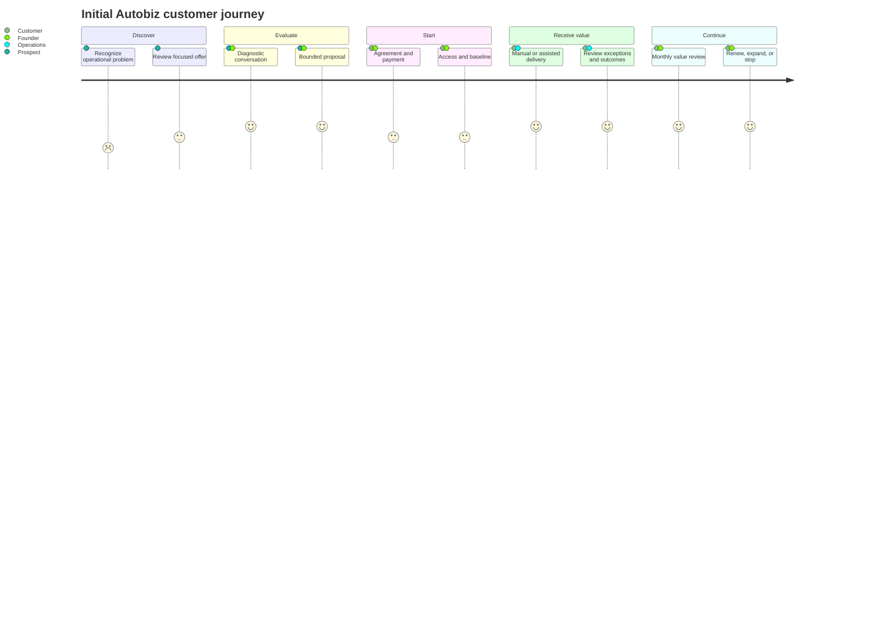

# Operating model

## Organization design

Autobiz starts as functions, not staffed departments.

## Function charters

| Function | Accountable outcomes | Core metrics | Automation boundary |
|---|---|---|---|
| Leadership and control | Direction, priorities, risk, authority | Cash runway, objectives, unresolved risks | AI prepares evidence; founder decides |
| Marketing | Qualified attention and market learning | Interviews, qualified leads, channel conversion | Research and drafts allowed; mass sending requires approval |
| Sales | Appropriate customers and clear commitments | Meetings, proposals, wins, cycle time | Scoring/drafting allowed; price and commitments approved |
| Service delivery | Promised customer result | Timeliness, quality, exceptions, unit cost | Routine bounded execution; exceptions escalate |
| Customer success | Retention, support, learning | Response time, satisfaction, renewal, churn | Factual drafts allowed; disputes/refunds escalate |
| Finance and administration | Accurate records and cash visibility | MRR, collections, margin, runway | Reports/reminders allowed; payments and filings human-only |
| Product and technology | Reliable, secure capability | Availability, defects, automation success, cost | Deployment controlled; production authority restricted |

## Customer journey

## End-to-end operating rhythm

### Daily

- inspect failed or waiting workflow runs;
- resolve approval requests;
- respond to customer issues;
- check delivery commitments and cash alerts.

### Weekly

- review funnel, delivery, customer, and financial scorecards;
- inspect a sample of automated outcomes;
- review exceptions and prompt/workflow changes;
- choose the next constraint to remove.

### Monthly

- review customer value and retention;
- close management accounts with bookkeeping support;
- assess unit economics, AI cost, and founder time;
- review access, vendors, incidents, and risk register;
- decide whether evidence supports more automation.

## Responsibility model

| Decision/action | AI/software | Founder/operator | External specialist |
|---|---|---|---|
| Research and summarize approved information | Perform | Review samples | — |
| Draft routine communication | Draft | Approve initially | — |
| Apply documented qualification policy | Recommend | Review exceptions | — |
| Set price or make contractual promise | No authority | Decide | Legal input as needed |
| Send or move money | No authority | Approve/execute | Accountant oversight |
| Tax or regulatory filing | Prepare inputs only | Approve | Qualified professional |
| Change automation authority | No authority | Decide and record | Security/legal input as needed |
| Delete customer data | Propose per policy | Approve and verify | Legal input as needed |

## Functions deliberately not established initially

No separate HR, procurement, public relations, investor relations, research,
security, data-science, internal-IT, international-operations, or partnership
department. Essential duties are founder-owned, embedded in another function, or
outsourced until scale justifies specialization.

## Customer Zero functional view

For the local synthetic experiment, the existing responsibilities are grouped into
five simpler operating views without changing accountability or creating separate
departments:

| Customer Zero function | Existing responsibilities represented |
|---|---|
| Direction | Leadership, goals, priorities, and decisions |
| Growth | Marketing, sales, synthetic leads, and offers |
| Delivery | Service delivery, projects, tasks, and quality |
| Finance | Finance, prices, costs, cash, and forecasts |
| Operations | Approvals, risks, audits, and reporting |

The experiment and daily loop are specified in
[Customer Zero experiment](13-customer-zero.md).

The implemented human control point is a staff-only operator console. It exposes
deterministically calculated measures, work priority, pending approvals, operating
cycle history, and append-only audit events. It remains one functional view inside
the Django monolith rather than a new department or agent.
