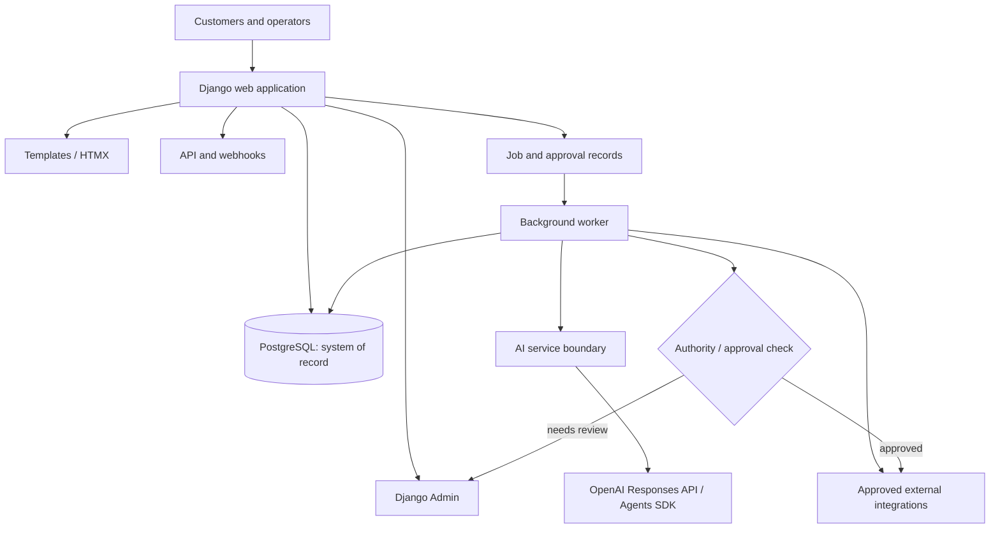
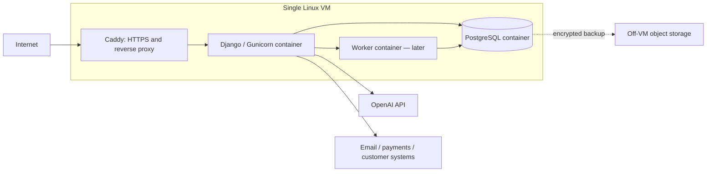
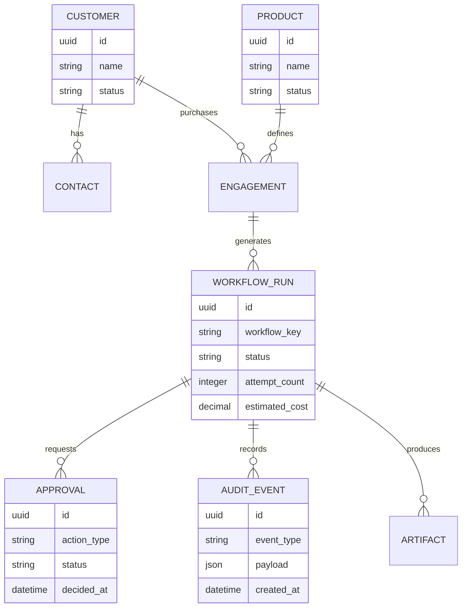
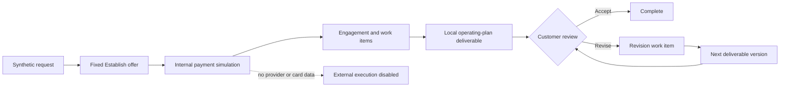
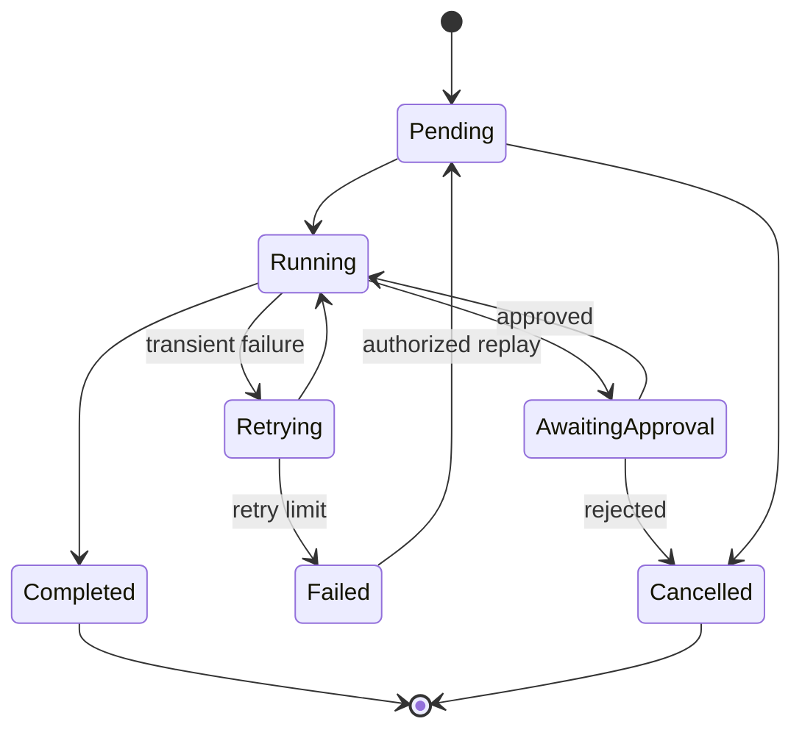

# System architecture

## Architecture principles

- Modular monolith before distributed services.
- PostgreSQL is the business system of record.
- Deterministic software controls policy; models assist with interpretation.
- Every consequential action has an authority check and audit event.
- External side effects are idempotent and retriable.
- Development is local; production uses the same container image.

## Logical architecture

## Initial deployment

PostgreSQL may move to a managed service before scaling the application across
multiple hosts.

## Core data model

The implemented Customer Zero boundary includes company state, goals, opportunities,
work, finance, risk, metrics, operating cycles, action proposals, approvals, and
append-only audit events. The synthetic customer journey adds CustomerRequest,
Offer, SyntheticPayment, and Deliverable while keeping PostgreSQL authoritative.

## Synthetic customer journey boundary

Pricing and artifact generation are deterministic domain-service behavior. Customer
input is untrusted data, not an instruction channel. Real payment or customer mode
is outside this boundary and requires authentication, authorization, verified
webhooks, reconciliation, legal, tax, privacy, refund, and operational controls.

Deliverables use a per-request version number and a database-enforced single-current
constraint. Prior versions remain authoritative history; revisions create new rows
rather than overwriting reviewed artifacts.

## Workflow state

## Initial stack

| Concern | Choice | Reason |
|---|---|---|
| Runtime | Python 3.12 | Mature ecosystem and existing environment |
| Application | Django | ORM, migrations, authentication, permissions, admin |
| UI | Django templates; HTMX when needed | Avoid premature frontend application complexity |
| Database | PostgreSQL | Durable relational system of record |
| AI | OpenAI Agents SDK / Responses API | Tools, structured output, guardrails, tracing |
| Worker | Add after a real asynchronous workflow exists | Avoid queue infrastructure before need |
| Durable orchestration | LangGraph or Temporal only after evidence | Complexity must be justified by workflow behavior |
| Local/production packaging | Docker Compose | Reproducible single-host operation |
| HTTPS | Caddy in production | Simple certificate and reverse-proxy management |
| Testing | pytest + pytest-django | Fast automated verification |
| Quality | Ruff + Pyright | Formatting, linting, and type checking |

## Environments

| Environment | Application | Database | External effects |
|---|---|---|---|
| Unit tests | Local process | Temporary SQLite initially | Mocked |
| Local development | `.venv` | PostgreSQL via Compose | Test/sandbox only |
| Local system test | Containers | PostgreSQL container | Test/sandbox only |
| Staging | VM/container | Separate PostgreSQL | Test accounts and restricted sending |
| Production | VM/container | Production PostgreSQL | Explicitly authorized |

## Operational health and logs

- `GET /health/` is a liveness check and does not query dependencies.
- `GET /ready/` executes a minimal database query and returns 503 when PostgreSQL is unavailable.
- Containers use readiness for health reporting.
- Every request receives an `X-Request-ID`; safe incoming identifiers are preserved.
- Application request events are emitted as JSON with method, path, status, duration,
  and request ID. Query strings, bodies, credentials, and model/customer payloads are excluded.
- Database backups use PostgreSQL custom format and are validated through an isolated
  scratch restore before being considered usable.

## Deliberate exclusions

No Kubernetes, microservices, vector database, multi-agent hierarchy, React SPA,
self-hosted model, or general integration platform in the initial architecture.
