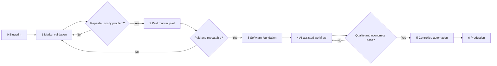

# Delivery plan

**Plan owner:** Founder
**Planning method:** Evidence-gated milestones
**Status vocabulary:** Not started / In progress / Deferred — required / Blocked / Complete

Current execution progress is tracked in the
[Business readiness roadmap](15-business-readiness-roadmap.md). This document retains
the program-level delivery sequence and decision gates.

## Program view

## Milestones

| ID | Milestone | Principal deliverables | Exit criterion | Status |
|---|---|---|---|---|
| 0 | Company blueprint | Canvas, strategy, product, operating model, architecture, controls, model | Documents reviewed; hypotheses explicit | Complete — approved 2026-07-28 |
| 1 | Market validation | Interview guide, candidate register, interview notes, evidence synthesis | Repeated costly problem in the selected segment | Deferred — required |
| 2 | Paid manual pilot | Offer, agreement, onboarding, SOP, baseline, delivery log | Customer pays and receives measurable result | Not started |
| 3 | Software foundation | Django, PostgreSQL, Admin, tests, containers | Manual workflow represented and managed | In progress |
| 4 | AI-assisted workflow | Structured model calls, tools, eval set, approval queue | Effort falls without quality loss | Not started |
| 5 | Controlled automation | Worker, retry limits, scheduling, alerts, recovery | Routine cases complete; exceptions fail safely | Not started |
| 6 | Production | VM, HTTPS, backups, monitoring, email/payment, policies | Customer can use and pay reliably | Not started |

## Deliberate parallel-work policy

The founder deferred candidate outreach and the first five interviews on 2026-07-28.
This does not remove or weaken the market-validation gate.

While validation is deferred, work may continue on:

- generic Django and PostgreSQL reliability;
- test infrastructure and CI;
- local Docker and migration checks;
- logs, health checks, backup/restore rehearsal, and developer documentation;
- generic approval, audit, and permission primitives; and
- reversible prototypes that do not assert customer requirements.

Customer Zero is one such reversible prototype. It uses only clearly marked
synthetic records, keeps external execution disabled, and measures control-system
behavior rather than customer demand. Its scope is defined in
[Customer Zero experiment](13-customer-zero.md).

Work must not continue on:

- product-specific AI workflows or prompts;
- customer-system integrations chosen without evidence;
- autonomous external communication or consequential actions;
- firm pricing, positioning, or performance claims;
- production launch or real customer data processing; or
- infrastructure scale based only on forecast assumptions.

The explicit gate is maintained in
[Required validation gate](09-required-validation-gate.md).

## First 12 weeks

| Week | Focus | Output | Decision |
|---:|---|---|---|
| 1 | Candidate segments | Prospect list and interview script | Are interviewees accessible? |
| 2–3 | Problem interviews | 10–15 interview records | Is one problem recurring and costly? |
| 4 | Workflow observation | Current-state maps and baseline measures | Can it be standardized? |
| 5 | Offer design | Bounded pilot offer and price tests | Will prospects request proposals? |
| 6–8 | Paid manual pilot | Delivery log, exceptions, outcome | Does the result create value? |
| 9 | Evidence review | Unit economics and product decision | Continue, adjust, or pivot? |
| 10–11 | Minimal product increment | Only proven workflow support | Does software reduce effort safely? |
| 12 | Operating review | Updated plan and next-quarter objective | Is controlled automation justified? |

## Workstreams

### Customer evidence

- define screening criteria;
- conduct interviews without pitching prematurely;
- observe actual tools and artifacts;
- record exact language, frequency, cost, and workaround;
- request a commercial commitment.

### Service design

- define intake, output, timing, exclusions, and escalation;
- produce an operator checklist;
- establish a quality rubric;
- measure every execution and exception.

### Product and technology

- maintain a modular Django foundation;
- add functionality only against a validated requirement;
- treat AI output as untrusted until validated;
- keep production side effects behind explicit tools and authority checks.

### Company operations

- establish bookkeeping and legal support before trading;
- maintain cash and unit-economics visibility;
- define privacy, retention, incident, and vendor practices before production data.

## Decision gates

| Gate | Required evidence | Stop/pivot signal |
|---|---|---|
| Problem | Repeated, costly, urgent problem | Polite interest without current action or budget |
| Offer | Proposal requests and paid pilot | Requests for free customization only |
| Repeatability | Shared workflow and manageable exceptions | Most work unique to each customer |
| Economics | Positive contribution margin and credible scale path | Hidden founder effort or API costs erase margin |
| Automation | Stable quality, safe recovery, clear controls | Unpredictable errors or weak observability |
| Production | Security, backup, support, and legal readiness | Unresolved high-impact control gap |

## Definition of done

A milestone is complete only when its exit criterion is supported by an artifact or
measured result. Activity alone does not count as progress.
