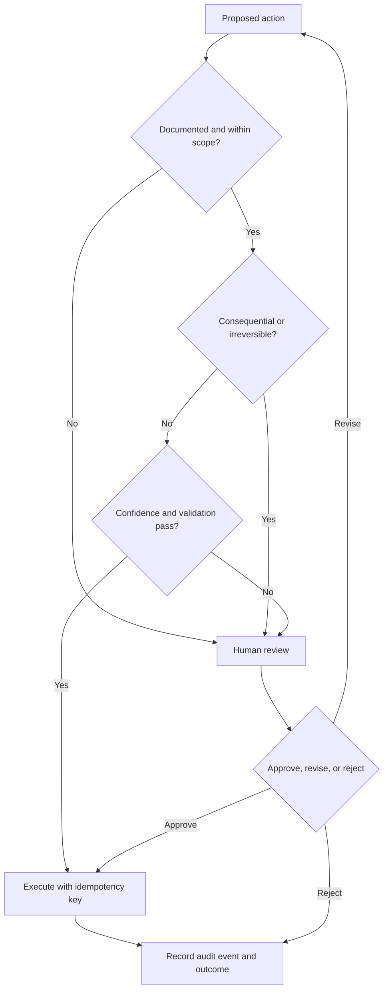

# Controls and risks

## Authority model

## Initial authority levels

| Level | Description | Examples |
|---|---|---|
| 0 — Observe | Read approved data and prepare analysis | Reporting, classification, anomaly detection |
| 1 — Draft | Produce an artifact without external effect | Email draft, summary, checklist |
| 2 — Bounded execute | Reversible, low-risk action under policy | Create internal task, update noncritical status |
| 3 — Human approval | Consequential action proposed, person decides | External email, proposal, refund request |
| 4 — Prohibited | No autonomous path | Money movement, contracts, tax filing, destructive bulk change |

The initial product operates primarily at levels 0–1. Level 2 requires tested
policy and audit coverage. Levels 3–4 remain human-controlled.

## Required controls per workflow

- named owner and purpose;
- explicit input and output schema;
- approved tools and data sources;
- maximum tool calls, retries, elapsed time, and cost;
- validation and confidence rules;
- idempotency for side effects;
- human escalation path;
- immutable audit events for material actions;
- evaluation cases including failures and adversarial input;
- rollback or recovery procedure; and
- versioned prompt, policy, and workflow configuration.

## Risk register

| Risk | Likelihood | Impact | Initial mitigation | Owner |
|---|---|---|---|---|
| Build before demand | High | High | Interviews and paid manual pilot precede product expansion | Founder |
| Incorrect AI output | High | Medium–High | Structured output, validation, approval, sampling, evals | Product |
| Unauthorized external action | Medium | High | Least privilege, approval gates, allowlisted tools, audit | Founder |
| Customer-data exposure | Medium | High | Data minimization, access controls, secret separation, retention policy | Founder |
| Prompt injection through customer content | Medium | High | Treat content as untrusted, isolate instructions, restrict tools | Product |
| Duplicate email or external side effect | Medium | Medium–High | Idempotency keys, state checks, delivery receipts | Product |
| Workflow silently stalls | Medium | High | Deadlines, retry limits, waiting-state dashboard, alerts | Operations |
| Vendor/API outage | Medium | Medium | Timeouts, retries, queued recovery, manual fallback | Product |
| Poor unit economics | Medium | High | Measure founder time and per-run cost from first pilot | Founder |
| Regulatory mismatch | Low–Medium | High | Avoid sensitive verticals initially; seek qualified advice | Founder |
| Key-person dependency | High | Medium | SOPs, audit trail, backups, documented recovery | Founder |
| Backup cannot restore | Medium | High | Offsite backups and scheduled restoration tests | Product |

## Incident priorities

| Severity | Description | Response target |
|---|---|---|
| Critical | Active data exposure, unauthorized money/action, widespread outage | Stop affected automation immediately; notify owner |
| High | Material customer impact or repeated incorrect actions | Contain same day; human service fallback |
| Medium | Isolated failure with workaround | Triage next business day |
| Low | Cosmetic or nonurgent defect | Prioritize through normal planning |

## Production readiness checklist

- [ ] Customer and product scope validated
- [ ] Privacy notice, contract, and data-processing terms reviewed
- [ ] Production secrets separated from development
- [ ] Administrator accounts protected with strong authentication
- [ ] Tool permissions use least privilege
- [ ] External actions have approval/idempotency controls
- [ ] Logs avoid unnecessary sensitive content
- [ ] Error, queue, disk, and uptime alerts tested
- [ ] Backups encrypted, offsite, and restored successfully
- [ ] Incident owner and customer communication path defined
- [ ] AI evaluations and manual fallback tested
- [ ] Spending and retry limits configured

## Implemented foundation controls

As of 2026-07-28, the generic foundation includes:

- transactional, one-time approval decisions;
- append-only audit events protected through model and queryset mutation paths;
- read-only AuditEvent administration;
- request correlation identifiers and structured request logs;
- separate liveness and database readiness checks;
- local PostgreSQL backup and isolated restore rehearsal scripts; and
- CI definitions for Python dependency and high/critical container vulnerability scanning.

These controls are generic primitives. They do not authorize a product workflow or
clear the required market-validation gate.

## Customer Zero enforcement

The Customer Zero experiment implements action-type authority rules in deterministic
application code. Approval does not itself provide execution capability: an action
must also have an available executor, and external execution must be enabled at the
company level. During Customer Zero, external execution is always disabled and
unknown action types fail closed as prohibited. The complete scenario matrix is in
[Customer Zero experiment](13-customer-zero.md).

The staff-only operator console can approve or reject a pending synthetic proposal.
The decision records owner, time, note, linked proposal state, and an audit event.
An approval never overrides the separate executor-availability and company-wide
external-execution checks.

The synthetic customer portal accepts only local test records. It requests no card
details and has no payment-provider integration. Customer-entered text is treated as
untrusted data and rendered with escaping. Journey links are intentionally unauthenticated
only while the system is local and synthetic; authentication, authorization, verified
payment webhooks, reconciliation, tax, contractual, privacy, and refund controls are
required before any real-customer or live-payment mode.
