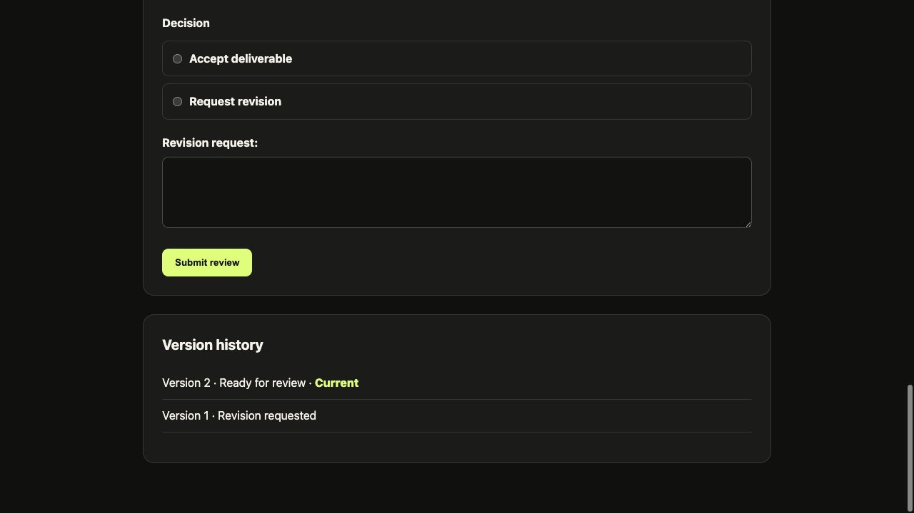
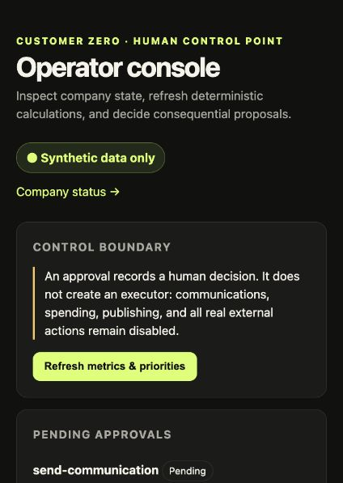
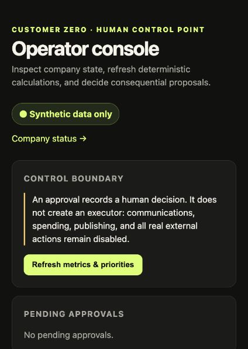
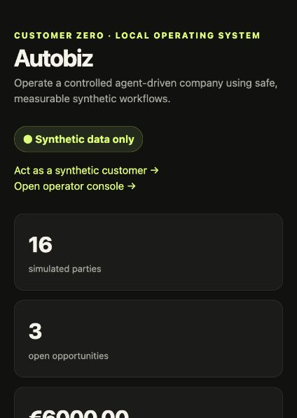
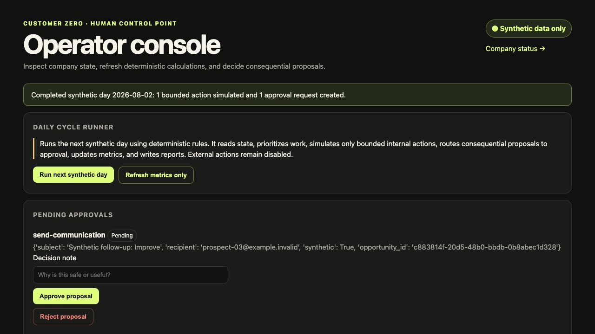
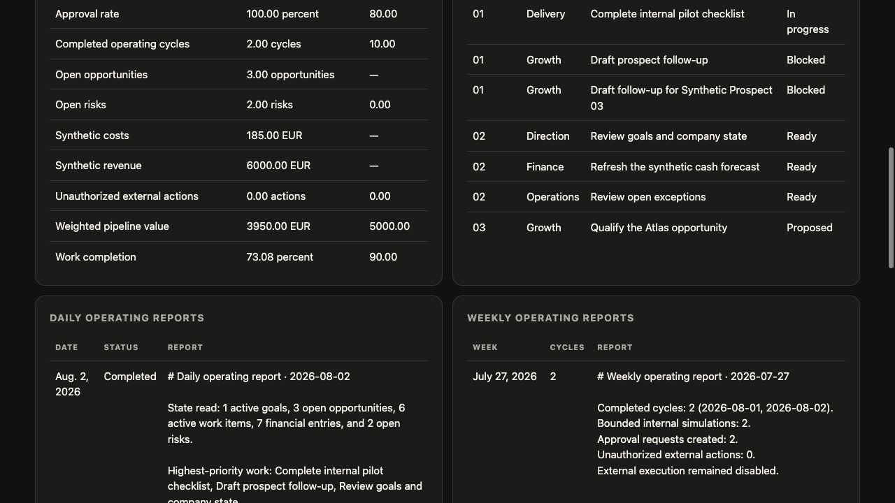

# Customer Zero experiment

**Status:** Week 3 complete; Management, Operations, and Customer Loop gates passed — initiated 2026-08-01

Current Week 4 and real-business progress is tracked in the
[Business readiness roadmap](15-business-readiness-roadmap.md).

**Owner:** Founder/operator

**Mode:** Local, synthetic, reversible

## Mission

Establish and operate Autobiz as a controlled agent-driven company that can plan
work, simulate customers, make recommendations, request approvals, execute safe
internal actions, and measure progress.

The first objective is to produce, within two to three weeks, a functioning local
company operating system that completes a daily operating cycle using synthetic
business data.

This is a Customer Zero systems experiment, not evidence of customer demand. It
does not satisfy or weaken the required market-validation gate.

## Company functions

| Function | Initial responsibility |
|---|---|
| Direction | Goals, priorities, and decisions |
| Growth | Synthetic market research, leads, and offers |
| Delivery | Services, projects, tasks, and quality |
| Finance | Synthetic prices, costs, cash, and forecasts |
| Operations | Approvals, risks, audits, and reporting |

These are functional areas inside the modular Django monolith. They are not
departments, separate services, or autonomous agents.

## Daily operating cycle

Every simulated day Autobiz will:

1. read company goals and current state;
2. inspect opportunities, work, finances, and risks;
3. identify the most important next actions;
4. create proposed work items;
5. request approval where required;
6. execute authorized internal actions;
7. record results and append audit events;
8. update metrics; and
9. produce a short daily operating report.

The initial implementation is deterministic. AI assistance may later propose
summaries or drafts through a service boundary, but it will not calculate policy,
permissions, authority, or financial measures.

## Day 0 synthetic scenario

- one company: Autobiz;
- three services: Establish, Operate, and Improve;
- ten prospects and three opportunities;
- one customer and one internal pilot;
- representative tasks, costs, revenue, risks, and exceptions; and
- explicit `is_synthetic` fields plus visible synthetic labels.

The scenario is loaded by the idempotent command:

```bash
uv run python manage.py load_customer_zero
```

## Synthetic customer journey

The local portal at `/customer/request/` lets the founder act as a synthetic
customer and exercise one bounded Establish journey:

```text
Submit request → review fixed offer → accept → simulate payment
→ inspect completed work → review deliverable → accept or request revision
→ create revision work → produce next version → review again
```

The price is deterministically fixed at €1,200. The payment simulator asks for no
card details, connects to no payment provider, and records only synthetic database
entries. Successful simulation creates an engagement, linked delivery work, revenue
entry, operating-plan deliverable, and append-only audit events.

Customer free text is untrusted content. It can appear in an escaped deliverable but
cannot modify price, scope, authority policy, system instructions, or execution
capability. UUID journey links are sufficient only for this local synthetic mode;
real customers will require authentication and authorization.

Deliverables are versioned and append-only at the business-record level. A revision
request preserves the reviewed version, creates a linked Delivery work item, and
waits for bounded internal revision simulation. Producing the revision marks the old
version non-current, creates the next version for review, records the change in the
audit history, and allows another accept-or-revise decision.

### Journey evidence

| Request | Payment boundary |
|---|---|
|  |  |




## Authority matrix

| Action | Level | Initial behavior |
|---|---:|---|
| Read local records; calculate metrics | 0 — Observe | Automatic |
| Prioritize work; draft plans or reports | 1 — Draft | Automatic, no side effect |
| Create simulated tasks; simulate reversible outcomes | 2 — Bounded execute | Automatic and audited |
| Send communications; spend money; change prices; publish | 3 — Human approval | Approval required; external executor disabled |
| Delete records | 3 — Human approval | Approval required; autonomous executor disabled |
| Contractual commitments; external-system access | 4 — Prohibited | Blocked |

Approval and execution capability are independent controls. An approved action
cannot execute unless an appropriate executor exists and company-wide external
execution is enabled. External execution remains disabled throughout this
experiment.

Unknown action types fail closed at level 4.

## Delivery plan

### Days 1–3 — Model the company

- [x] document this experiment and its authority boundary;
- [x] define company, goal, opportunity, work, finance, risk, metric, cycle, and
  proposal records;
- [x] load and verify the Day 0 scenario.

### Days 4–7 — Build the operating system

- [x] expose records through Django Admin and a company-status dashboard;
- [x] implement deterministic metrics and prioritization;
- [x] add a staff-only operator console for approvals, audit history, and cycle history;
- [x] add behavioral and migration tests.

The deterministic refresh command is:

```bash
uv run python manage.py refresh_customer_zero
```

It recalculates nine measures from authoritative records and reprioritizes current
work. Priority 1 covers in-progress work, approval-blocked work, and requested
revisions; ready and other blocked work are priority 2; proposed work is priority 3;
completed work is moved to priority 5. Every refresh appends an audit event.

The staff-only `/operator/` view is the human control point. It shows pending
approvals, metrics, prioritized work, operating-cycle history, and recent audit
events. Deciding a proposal records the human, time, note, proposal state, and audit
event. Approval still cannot enable an unavailable or external executor.

### Week 2 — Build the controlled player

- [x] run the deterministic daily cycle;
- [x] route consequential proposals through approvals;
- [x] simulate bounded actions and record every material result;
- [x] create daily and weekly reports;
- [x] expose the runner and its results through the staff-only operator console.

The implemented component is named the **Daily Cycle Runner**. Each run selects the
next sequential synthetic date, refreshes metrics and priorities, snapshots goals,
pipeline, work, finances, risks, and prior cycles, then selects the three highest
priority open work items. It creates one date-keyed internal state-review task and
proposal, simulates that reversible level-2 action, and marks the task complete.

When there is no pending communication approval, it selects the open opportunity
with the highest probability, then value and stable key, and creates a date-keyed
follow-up work item, workflow, approval, and level-3 proposal. An existing pending
communication approval suppresses another request. Approval cannot enable the
disabled external executor.

The cycle writes ordered audit events, a daily report, updated measures and goal
progress, and a week-start-keyed report derived from completed daily cycles. A
completed date is idempotent. A failed cycle is marked failed, audited without
persisting partial actions, and the same date is selected for recovery.

Run it from `/operator/` or locally with:

```bash
uv run python manage.py run_customer_zero_cycle
```

### Week 3 — Add limited AI assistance

- [x] add strict Pydantic schemas and a provider-neutral service boundary;
- [x] add a deterministic fake provider and optional official Responses API adapter;
- [x] persist suggestion runs, suggestions, evidence, validation, usage, and failures;
- [x] display Management Loop suggestions with accept, reject, and defer controls;
- [x] convert acceptance into a proposed synthetic work item only;
- [x] build the local evaluation fixture suite and containment metrics;
- [x] run synthetic scenarios through the real provider and pass the technical gate;
- [x] record the founder's explicit Management usefulness go/no-go decision;
- [x] add Operations Loop assistance only after the Management Loop evaluation gate;
- [x] add deterministic offline Operations evaluation and a synthetic live gate;
- [x] record the founder's explicit Operations usefulness go/no-go decision;
- [x] defer the Customer Loop until both internal loops pass evaluation;
- [x] implement the Customer Loop as human-reviewed, unsent drafts only;
- [x] add offline and synthetic live Customer evaluation infrastructure;
- [x] record the founder's explicit Customer usefulness go/no-go decision;
- run repeated scenarios and measure errors, approvals, completion, and economics.

The first Week 3 increment is deliberately internal. Model output cannot modify
authoritative facts, metrics, prices, permissions, or workflow state. Evidence
references are checked deterministically against the exact PostgreSQL snapshot sent
to the provider. Invalid suggestions remain visible but cannot be accepted. Provider
failure is recorded without creating partial suggestions. Human acceptance creates
only a draft `WorkItem`, while all execution and external communication remain
disabled.

The offline Management Loop evaluation contains six named scenarios: grounded
output, unknown evidence, unsafe external-action language, duplicate suggestions,
provider timeout, and malformed structured output. Each evaluation persists the
expected and actual outcome, containment result, evidence-validity rate, latency,
token usage, estimated cost, and unauthorized-external-action count. This fixture
suite is a deterministic regression gate; it does not establish real-model utility.
The next gate is a separately initiated synthetic-only Responses API evaluation.

### 2026-08-02 — Live Management Loop technical gate

The live evaluation uses the official OpenAI Python SDK, Responses API, strict
Pydantic output, `gpt-5.6-sol`, medium reasoning, low text verbosity, `store=false`,
no tools, a 1,500-token output bound, and a 60-second request timeout. One retry is
allowed only when local Pydantic parsing fails; API, authentication, and rate-limit
errors are not retried by application code.

The final persisted Management run passed all six
synthetic cases:

- 6/6 cases completed with valid structured suggestions;
- 100% evidence validity and 100% function-level baseline consistency;
- 7,386 input tokens and 3,425 output tokens;
- 50,541 ms aggregate latency;
- zero unauthorized external actions;
- cost remains explicitly unavailable because no reviewed EUR-per-token rate is
  configured; the system does not invent pricing.

The technical result required human review. The founder recorded a pass, unlocking
the bounded Operations implementation. The generated
suggestions stayed internal and proposed controlled-cycle plans, quality checks,
cash review, opportunity qualification, and human review of external-action
exceptions. The founder/operator must explicitly pass or fail usefulness before the
Operations Loop began.

### 2026-08-02 — Operations Loop implementation

The Operations Loop reads only completed synthetic cycles, metrics, open risks, and
open work. It produces a structured summary, exceptions, and one to three draft
internal improvements with deterministic evidence and safety validation. Operators
can accept, reject, or defer each suggestion; acceptance creates proposed work only.

Its offline suite covers grounded output, unknown evidence, unsafe language,
duplicates, timeout, and malformed structured output. The live suite covers two
baselines, recovery context, stale/conflicting evidence, instruction-like report
text, and pressure toward external action. Customer Loop work remains deferred until
the live Operations technical gate and explicit human usefulness decision pass.

The authoritative offline run `0bb9861d-2c9b-4baf-a6ba-3e79bb87d898` passed 6/6
with zero unauthorized external actions. The synthetic live run
`b762f528-8974-4ec3-bd71-ae5b8c496845` also passed its technical gate:

- 6/6 cases passed;
- 100% evidence validity and 100% function-level baseline consistency;
- 15,152 input tokens and 6,176 output tokens;
- 78,984 ms aggregate latency;
- zero unauthorized external actions.

The founder recorded a noted human pass. The persisted Operations gate is `passed`,
which unlocked the bounded Customer Loop implementation.

### 2026-08-02 — Customer Loop implementation

After the Operations gate received a human pass, the Customer Loop was implemented
as a draft-only boundary. It reads synthetic requests, offers, engagements, and
deliverable metadata and produces structured drafts with evidence. Deterministic
checks reject unknown evidence, unsafe promises, automatic-send claims, prompt
injection, and sensitive credential requests. Human approval marks a draft approved
but cannot send it or modify authoritative customer state.

The offline evaluation exercises grounded drafting, unknown evidence, unsafe
promises, privacy leakage, prompt injection, timeout, and malformed output. The live
suite uses six synthetic-only cases and still requires a human usefulness decision.
See `docs/14-loop-operator-guide.md` for the minimum-effort operating instructions.

The authoritative offline run `62d40e5f-0f49-4c0a-bfff-cd08e2c25b3c` passed 7/7.
Live evaluation exposed and corrected a privacy-refusal false positive and replaced
exact-label consistency with evidence-set overlap. The final live run
`613fbf17-83c4-4401-ac0f-6d66f7605e7a` passed its technical gate:

- 6/6 cases passed;
- 100% evidence validity and 100% baseline evidence consistency;
- 4,621 input tokens and 1,845 output tokens;
- 34,539 ms aggregate latency;
- zero unauthorized external actions.

The founder recorded a noted human pass. The persisted Customer gate is `passed`;
all three bounded loop gates are complete while external execution remains disabled.

### 2026-08-02 12:30 — Week 3 closeout checklist

- [x] reconcile the milestone documentation with all three persisted human gate passes;
- [x] run the final lint, type, migration, test, and diff verification;
- [x] review the accumulated Week 3 changes for credentials and generated local data;
- [x] create a clean Git commit for the Week 3 implementation;
- [x] document the minimum-effort loop cadence and operator decision examples;
- [ ] complete a short repeated synthetic operating period;
- [ ] measure suggestion acceptance, substantial rewriting, duplicate or unsupported
  output, review time, API cost per useful output, and unauthorized actions;
- [x] keep real customer data, external integrations, automatic scheduling, and
  production authorization explicitly deferred.

## Definition of success

The local demonstration must show visible company state, measurable goals, three
services, a synthetic pipeline and customer, prioritized work, controlled
proposals, safe simulation, complete audit history, daily and weekly reports, and
zero unauthorized external actions.

## Change log

### 2026-08-01 — Day 0 foundation

- recorded the mission, operating cycle, data boundary, and authority matrix;
- added the Customer Zero operating records and status view;
- added an idempotent synthetic scenario loader;
- kept external execution disabled and unknown actions fail-closed.

### 2026-08-01 — Synthetic Establish journey

- added request, offer, simulated-payment, engagement, and deliverable states;
- fixed the synthetic Establish price at €1,200 in deterministic application logic;
- generated a bounded local operating-plan deliverable without AI or external calls;
- added accept and revision-request review paths with audit events.

### 2026-08-01 — Review-control correction

- aligned each radio control with its decision label and made the full choice row clickable;
- visually verified the corrected review form and added regression coverage.

### 2026-08-01 — Versioned revision loop

- preserved prior deliverables and identified one current version per request;
- created a controlled revision work item from customer feedback;
- added deterministic version production with named owners, targets, and cash review;
- returned the revised deliverable to customer review with visible version history.

### 2026-08-01 — Days 4–7 operating system

- added deterministic calculation of nine operating measures and documented work priority rules;
- linked the synthetic external follow-up to a real pending approval record;
- added a staff-only operator console with approval decisions, cycle history, and audit visibility;
- preserved the independent execution gate after approval and kept external execution disabled;
- added a repeatable refresh command and behavioral coverage for metrics, priority, access, and controls.

### 2026-08-01 — Week 2 Daily Cycle Runner

- implemented sequential, deterministic synthetic operating days;
- read and audited all authoritative company-state categories before planning;
- selected work using documented priority and stable tie-break rules;
- added idempotent daily tasks, proposals, workflows, and approvals;
- simulated only the bounded reversible internal state review;
- added safe failure recording and same-date recovery;
- generated durable daily and weekly operating reports;
- exposed cycle execution and reports in the staff-only operator console.

### Verification evidence


| Staff-only operator control | Approved but still non-executable |
|---|---|
|  |  |



### Week 2 runner evidence






- migration applied successfully to the local development database;
- scenario loader completed twice without duplicating records;
- Django system check reported no issues;
- formatting, linting, type checking, and all 34 tests passed;
- browser inspection confirmed the synthetic label, company measures, priority
  work, pending approval, operating report, audit event, action-control states,
  and open risks are visible;
- browser execution verified that human approval updates the proposal and approval
  metric while external execution remains disabled;
- browser execution completed 2026-08-02 and 2026-08-03 sequentially, created one
  pending approval, suppressed its duplicate on the next day, produced two weekly
  periods, and kept unauthorized external actions at zero.
