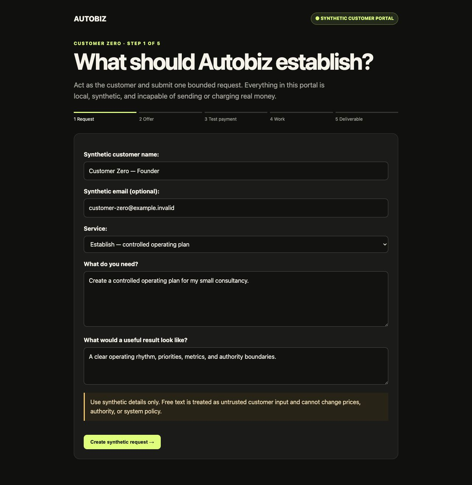
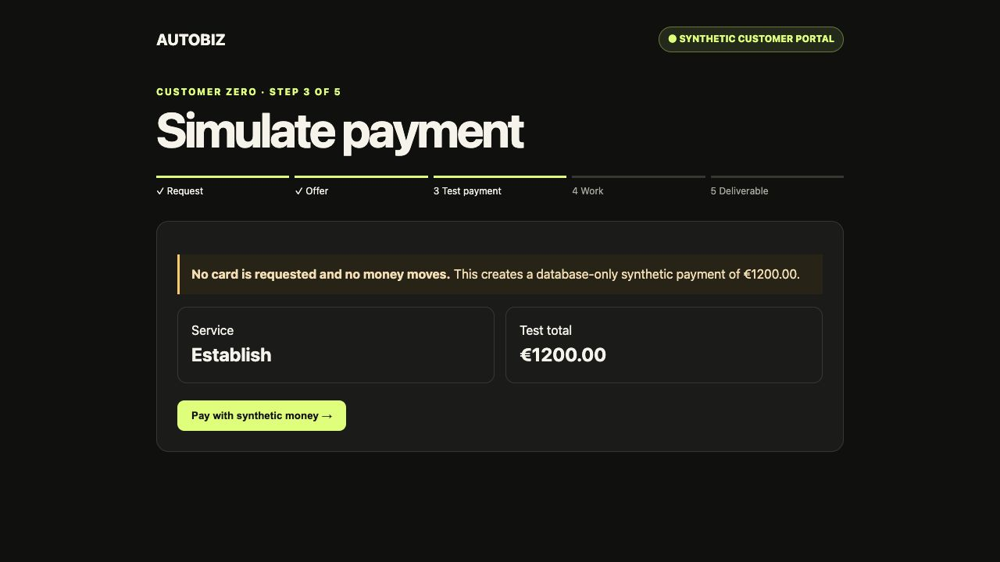
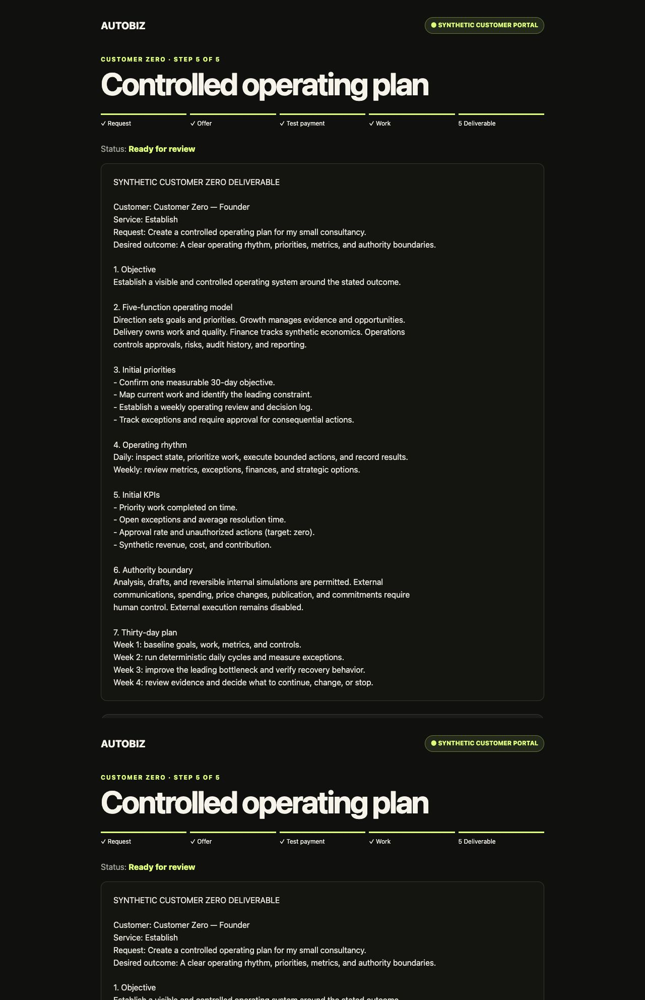
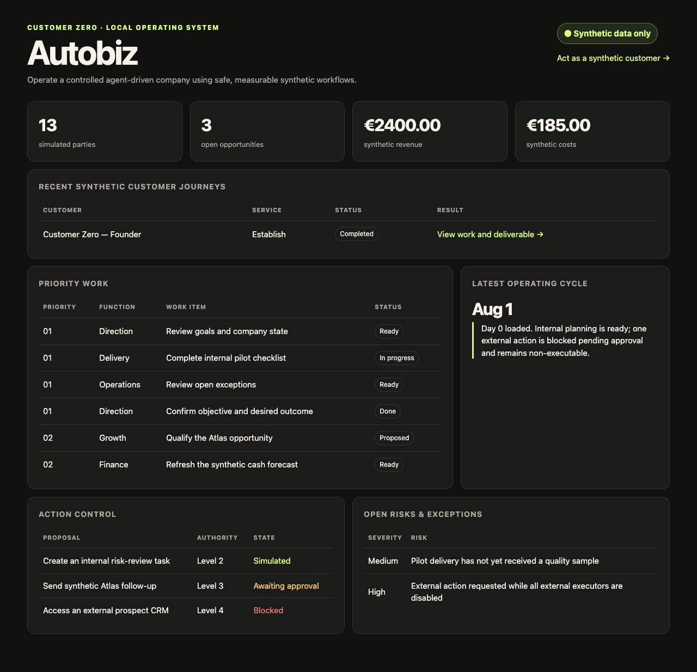
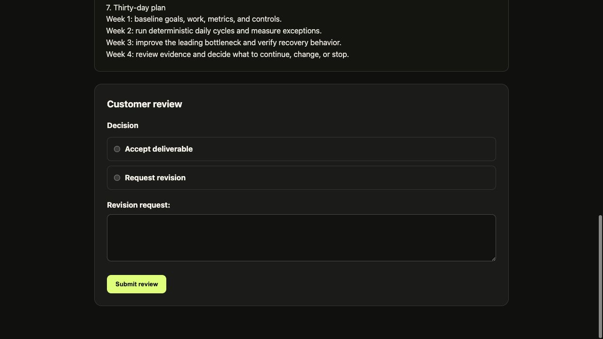
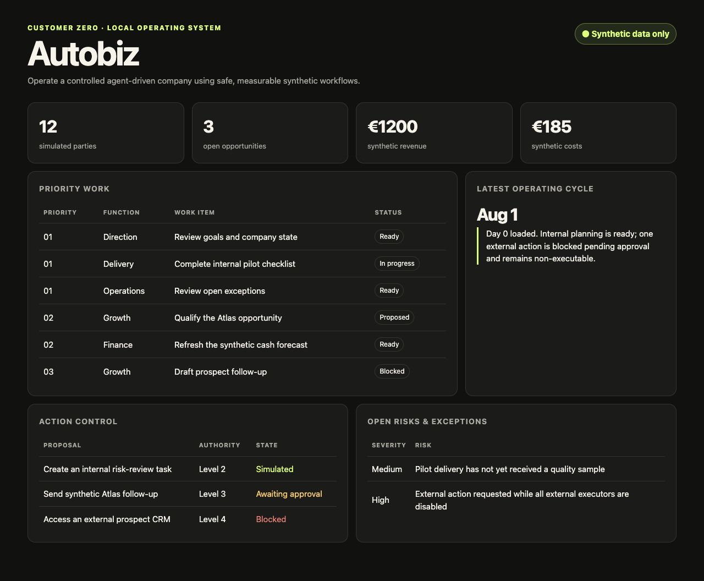

# Customer Zero experiment

**Status:** In progress — initiated 2026-08-01

**Owner:** Founder/operator

**Mode:** Local, synthetic, reversible

## Mission

Establish and operate Autobiz as a controlled agent-driven company that can plan
work, simulate customers, make recommendations, request approvals, execute safe
internal actions, and measure progress.

The first objective is to produce, within two to three weeks, a functioning local
company operating system that completes a daily operating cycle using synthetic
business data.

This is a Customer Zero systems experiment, not evidence of customer demand. It
does not satisfy or weaken the required market-validation gate.

## Company functions

| Function | Initial responsibility |
|---|---|
| Direction | Goals, priorities, and decisions |
| Growth | Synthetic market research, leads, and offers |
| Delivery | Services, projects, tasks, and quality |
| Finance | Synthetic prices, costs, cash, and forecasts |
| Operations | Approvals, risks, audits, and reporting |

These are functional areas inside the modular Django monolith. They are not
departments, separate services, or autonomous agents.

## Daily operating cycle

Every simulated day Autobiz will:

1. read company goals and current state;
2. inspect opportunities, work, finances, and risks;
3. identify the most important next actions;
4. create proposed work items;
5. request approval where required;
6. execute authorized internal actions;
7. record results and append audit events;
8. update metrics; and
9. produce a short daily operating report.

The initial implementation is deterministic. AI assistance may later propose
summaries or drafts through a service boundary, but it will not calculate policy,
permissions, authority, or financial measures.

## Day 0 synthetic scenario

- one company: Autobiz;
- three services: Establish, Operate, and Improve;
- ten prospects and three opportunities;
- one customer and one internal pilot;
- representative tasks, costs, revenue, risks, and exceptions; and
- explicit `is_synthetic` fields plus visible synthetic labels.

The scenario is loaded by the idempotent command:

```bash
uv run python manage.py load_customer_zero
```

## Synthetic customer journey

The local portal at `/customer/request/` lets the founder act as a synthetic
customer and exercise one bounded Establish journey:

```text
Submit request → review fixed offer → accept → simulate payment
→ inspect completed work → review deliverable → accept or request revision
```

The price is deterministically fixed at €1,200. The payment simulator asks for no
card details, connects to no payment provider, and records only synthetic database
entries. Successful simulation creates an engagement, linked delivery work, revenue
entry, operating-plan deliverable, and append-only audit events.

Customer free text is untrusted content. It can appear in an escaped deliverable but
cannot modify price, scope, authority policy, system instructions, or execution
capability. UUID journey links are sufficient only for this local synthetic mode;
real customers will require authentication and authorization.

### Journey evidence

| Request | Payment boundary |
|---|---|
|  |  |







## Authority matrix

| Action | Level | Initial behavior |
|---|---:|---|
| Read local records; calculate metrics | 0 — Observe | Automatic |
| Prioritize work; draft plans or reports | 1 — Draft | Automatic, no side effect |
| Create simulated tasks; simulate reversible outcomes | 2 — Bounded execute | Automatic and audited |
| Send communications; spend money; change prices; publish | 3 — Human approval | Approval required; external executor disabled |
| Delete records | 3 — Human approval | Approval required; autonomous executor disabled |
| Contractual commitments; external-system access | 4 — Prohibited | Blocked |

Approval and execution capability are independent controls. An approved action
cannot execute unless an appropriate executor exists and company-wide external
execution is enabled. External execution remains disabled throughout this
experiment.

Unknown action types fail closed at level 4.

## Delivery plan

### Days 1–3 — Model the company

- document this experiment and its authority boundary;
- define company, goal, opportunity, work, finance, risk, metric, cycle, and
  proposal records;
- load and verify the Day 0 scenario.

### Days 4–7 — Build the operating system

- expose records through Django Admin and a company-status dashboard;
- implement deterministic metrics and prioritization;
- add behavioral and migration tests.

### Week 2 — Build the controlled player

- run the deterministic daily cycle;
- route consequential proposals through approvals;
- simulate bounded actions and record every material result;
- create daily and weekly reports.

### Week 3 — Add limited AI assistance

- put model calls behind a provider-neutral service boundary;
- restrict AI to summaries, suggestions, and draft content;
- run repeated scenarios and measure errors, approvals, completion, and economics.

## Definition of success

The local demonstration must show visible company state, measurable goals, three
services, a synthetic pipeline and customer, prioritized work, controlled
proposals, safe simulation, complete audit history, daily and weekly reports, and
zero unauthorized external actions.

## Change log

### 2026-08-01 — Day 0 foundation

- recorded the mission, operating cycle, data boundary, and authority matrix;
- added the Customer Zero operating records and status view;
- added an idempotent synthetic scenario loader;
- kept external execution disabled and unknown actions fail-closed.

### 2026-08-01 — Synthetic Establish journey

- added request, offer, simulated-payment, engagement, and deliverable states;
- fixed the synthetic Establish price at €1,200 in deterministic application logic;
- generated a bounded local operating-plan deliverable without AI or external calls;
- added accept and revision-request review paths with audit events.

### 2026-08-01 — Review-control correction

- aligned each radio control with its decision label and made the full choice row clickable;
- visually verified the corrected review form and added regression coverage.

### Verification evidence



- migration applied successfully to the local development database;
- scenario loader completed twice without duplicating records;
- Django system check reported no issues;
- formatting, linting, type checking, and all 17 tests passed;
- browser inspection confirmed the synthetic label, company measures, priority
  work, operating report, action-control states, and open risks are visible.
