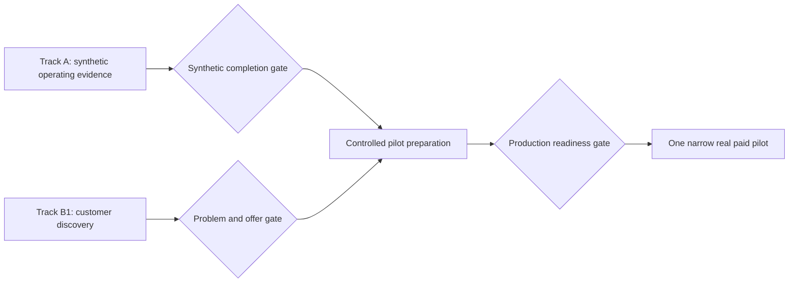

# Business readiness roadmap

**Owner:** Founder  
**Last updated:** 2026-08-02  
**Status vocabulary:** Not started / In progress / Blocked / Deferred / Complete  
**Current focus:** Week 4 — synthetic operating evidence and customer discovery

This is the current progress tracker for moving Autobiz from a controlled synthetic
prototype toward a real business. Completed implementation history remains in
[Customer Zero](13-customer-zero.md). Operating instructions remain in the
[loop operator guide](14-loop-operator-guide.md).

Synthetic success does not authorize real customer data, payments, communication,
or production use. Track B has independent evidence and approval gates.

## Program view

## Current milestone — Week 4

### Track A — Complete and measure the synthetic business

#### A1. Repeated operation

- [ ] complete five consecutive synthetic daily cycles;
- [ ] run Operations after each completed daily cycle;
- [ ] run Management after the final weekly metrics and risk refresh;
- [ ] exercise Customer with 5–10 varied synthetic requests;
- [ ] record every accept, defer, reject, and validation-failure outcome;
- [ ] confirm unauthorized external actions remain zero throughout.

#### A2. Measurement support

- [ ] add a 1–5 usefulness rating to reviewed loop output;
- [ ] add a substantial-rewrite-required indicator;
- [ ] measure review duration without adding automatic loop execution;
- [ ] configure founder-reviewed model input and output cost rates;
- [ ] calculate acceptance, rejection, deferral, validation-error, and rewrite rates;
- [ ] calculate cost and review time per accepted useful output;
- [ ] publish a compact weekly scorecard in the operator console.

#### A3. Synthetic completion gate

- [ ] all three loops operate reliably across the repeated period;
- [ ] the agreed useful-without-substantial-rewrite target is met;
- [ ] provider and operator costs are understood;
- [ ] at least one contained failure and recovery path is demonstrated;
- [ ] documentation matches observed behavior;
- [ ] the founder records a synthetic-business completion decision.

### Track B — Validate and prepare the real business

#### B1. Commercial validation

- [ ] select one customer segment and named workflow hypothesis;
- [ ] complete 5–10 problem interviews using the discovery playbook;
- [ ] capture frequency, cost, urgency, current workaround, and buying authority;
- [ ] identify a repeated costly problem or record a pivot decision;
- [ ] define one narrow manual pilot offer with scope, price, timing, and exclusions;
- [ ] obtain at least one written pilot commitment before production integration.

#### B2. Business foundations

- [ ] confirm legal entity and business bank arrangements;
- [ ] obtain jurisdiction-appropriate accounting and VAT guidance;
- [ ] prepare reviewed terms, privacy notice, retention policy, and refund policy;
- [ ] define customer support, incident, and escalation responsibilities;
- [ ] review OpenAI, hosting, Stripe, and email vendors for the intended data.

#### B3. Production foundations

- [ ] add production-grade customer authentication;
- [ ] add authorization and customer/tenant data isolation;
- [ ] implement retention, export, correction, and deletion controls;
- [ ] establish production secret management and environment separation;
- [ ] establish HTTPS, backups, restore testing, monitoring, and incident response;
- [ ] complete security, privacy, and production-readiness reviews.

#### B4. Payment pilot

- [ ] test a founder-created Stripe Payment Link in test mode;
- [ ] rehearse the complete synthetic payment, refund, and reconciliation process;
- [ ] decide whether the first pilot needs an integrated Checkout flow;
- [ ] if justified, add server-created Checkout Sessions and verified webhooks;
- [ ] make webhook processing idempotent and retain event/audit records;
- [ ] require human confirmation before starting paid delivery.

#### B5. Real-pilot gate

- [ ] a named prospect has made a credible commercial commitment;
- [ ] legal, tax, privacy, security, refund, and support requirements are reviewed;
- [ ] production controls and recovery rehearsals pass;
- [ ] payment, refund, dispute, and reconciliation procedures pass;
- [ ] the founder records an explicit real-pilot go/no-go decision;
- [ ] only then admit one narrowly scoped real paid pilot.

## Week 4 scorecard

| Measure | Target | Current | Evidence |
|---|---:|---:|---|
| Consecutive synthetic cycles | 5 | 0 | OperatingCycle records |
| Operations reviews | 5 | 0 | SuggestionRun records |
| Management reviews | 1 | 0 | SuggestionRun records |
| Customer request exercises | 5–10 | 0 | CustomerDraftRun records |
| Useful without substantial rewrite | Set after baseline | Not measured | Review fields |
| Unauthorized external actions | 0 | 0 | Evaluation and audit records |
| Problem interviews | 5–10 | 0 | Interview notes |
| Written pilot commitments | 1 | 0 | Founder-reviewed evidence |

The scorecard starts at zero for the Week 4 measurement window. Earlier evaluation
fixtures prove containment but do not count as repeated operation or market evidence.

## Immediate next actions

1. Add the minimal review-measurement fields and scorecard.
2. Start the five-day synthetic operating window.
3. Select interview candidates and begin problem interviews in parallel.
4. Review both evidence tracks at the end of Week 4.
5. Choose: continue testing, improve a weak loop, define a manual pilot, or pivot.

## Deferred until evidence justifies them

- automatic loop scheduling;
- real customer data ingestion;
- automatic email or customer communication;
- CRM and calendar integrations;
- integrated Stripe Checkout beyond a tested manual Payment Link;
- autonomous fulfillment or refunds;
- a fourth AI loop;
- production launch or claims of validated demand.

## Updating this roadmap

Check an item only when its evidence exists. Add the evidence link or record to the
relevant row or accompanying note. If evidence changes strategy, update this roadmap
and record the durable decision in `docs/decisions/`. Do not mark a milestone complete
based only on implementation activity.
