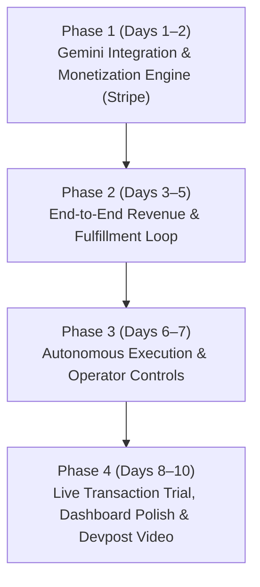

# Hackathon Plan: Autonomous Company with Real Revenue (Devpost Build with Gemini XPRIZE Challenge)

## Goal & Strategy

Build a working, autonomous **AI Business** powered by **Google Gemini** that **actually makes money** (generates real proposals, issues payable invoices/Stripe payment links, processes real customer transactions, and logs revenue) before the submission deadline.

**Target Deadline:** Finish in **10 Days** (leaving 3 days buffer for testing, video production, and Devpost submission).

---

## 10-Day Sprint Timeline

---

## Proposed Changes

### Phase 1: Gemini Provider Integration & Monetization Engine (Days 1–2)

#### [MODIFY] [pyproject.toml](file:///Users/cpg24/Development/codex/autobiz/pyproject.toml)
- Add `google-genai` and `stripe` dependencies. *(Completed)*

#### [MODIFY] [ai_providers.py](file:///Users/cpg24/Development/codex/autobiz/apps/operations/ai_providers.py)
- Implement `GeminiAIProvider` for Customer, Operations, and Management loops. *(Completed)*

#### [NEW] Monetization Service ([payments.py](file:///Users/cpg24/Development/codex/autobiz/apps/operations/payments.py))
- Stripe API integration: Create Checkout Sessions, Payment Links, and Customer Invoices. *(Next Step)*
- Webhook handler to confirm payment events and automatically mark orders as "PAID" in Django DB.

---

### Phase 2: End-to-End Commercial Loop (Days 3–5)

#### [MODIFY] Models & Services ([models.py](file:///Users/cpg24/Development/codex/autobiz/apps/operations/models.py), [services.py](file:///Users/cpg24/Development/codex/autobiz/apps/operations/services.py))
- **Lead / Request Intake:** Customer submits request or lead via `/customer/request/`.
- **Gemini Proposal & Pricing:** Customer loop uses Gemini to evaluate requirement, generate scope, price the job, and create a real Stripe Checkout / Payment Link.
- **Payment Event:** Upon payment confirmation, update company revenue ledger and trigger Operations Loop.
- **Service Fulfillment:** Operations loop generates final deliverable (e.g. audit report, onboarding package, consultation summary) and sends it to customer.

---

### Phase 3: Autonomous Mode & Operator Governance (Days 6–7)

#### [NEW] Autonomous Runner ([run_autonomous_cycle.py](file:///Users/cpg24/Development/codex/autobiz/apps/operations/management/commands/run_autonomous_cycle.py))
- Background worker executing daily/hourly business cycles:
  - Lead intake -> AI proposal generation -> Stripe link creation -> Fulfillment -> Management revenue scorecard refresh.
  - Auto-approve standard customer proposals under configurable thresholds; queue large deals for human Operator approval in `/operator/`.

---

### Phase 4: Live Paid Test, UI Polish & Submission (Days 8–10)

#### UI Enhancements ([views.py](file:///Users/cpg24/Development/codex/autobiz/apps/operations/views.py))
- **Live Revenue Ticker & Financial Scorecard:** Show real-time earnings, paid transactions, pending quotes, and bank balance on `/company/`.
- **Operator Control Panel:** Clear visibility of pending proposals, active Stripe links, and completed paid jobs.

#### Live Transaction Trial
- Execute 1+ real transaction ($1–$10 test payment or live pilot customer payment) via Stripe to prove real revenue generation for the hackathon criteria.

---

## User Review Required

> [!IMPORTANT]
> 1. **Stripe API Credentials:** Do you have access to a Stripe account (Test Mode or Live Mode keys: `STRIPE_SECRET_KEY` and `STRIPE_WEBHOOK_SECRET`) to test real payment processing?
> 2. **Target Service Offer:** For the immediate commercial offering, should Autobiz offer a specific, lightweight automated service (e.g., **"AI Technical & Lead Audit Report"** or **"Agency Client Onboarding Setup"** for $10–$50) that Gemini can immediately scope, price, and fulfill upon payment?

---

## Verification Plan

### Automated Tests
- Run `make check` (`ruff`, `pyright`, `pytest`) across all models, AI providers, and payment webhooks.
- Mock Stripe API tests to verify proposal generation and webhook revenue recording.

### Manual Verification
- Generate a proposal with Gemini, click the generated Stripe link, make a test payment, and verify that Django registers the revenue and triggers automated fulfillment.
